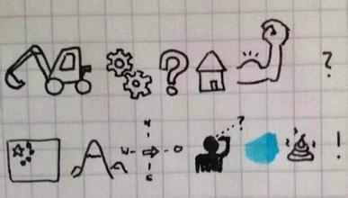

# 标识符和关键字

## 标识符

- 什么是标识符，请看下图:

  

  - 开发人员在程序中自定义的一些符号和名称

  - 标识符是自己定义的,如变量名 、函数名等

### 标识符的规则

<font color="#dd0000"><b>标识符由字母、下划线和数字组成，且数字不能开头</b></font>
<br>

<font color="#dd0000"><b>Python中的标识符是区分的大小写的</b></font>


### 标识符的命名规则

- 见名知意

  起一个有意义的名字，尽量做到看一眼就知道是什么意思(提高代码可 读性) 比如: 名字 就定义为 ``name``,定义学生 用 ``student``

- 驼峰命名法

  

- 小驼峰式命名法（lower camel case）： 第一个单词以小写字母开始；第二个单词的首字母大写，例如：myName、aDog

- 大驼峰式命名法（upper camel case）： 每一个单字的首字母都采用大写字母，例如：FirstName、LastName

- 还有一种命名法是用下划线``_``来连接所有的单词，比如``send_buf``

## 关键字

### 什么是关键字？

- python一些具有特殊功能的标识符，这就是所谓的关键字

- 关键字，是python已经使用的了，所以不允许开发者自己定义和关键字相同的名字的标识符

### 查看关键字

```
and     as      assert     break     class      continue    def     del
elif    else    except     exec      finally    for         from    global
if      in      import     is        lambda     not         or      pass
print   raise   return     try       while      with        yield
```
可以在Python Shell通过以下命令进行查看当前系统中python的关键字
  ```Python
  import keyword
  keyword.kwlist
  ```

  
