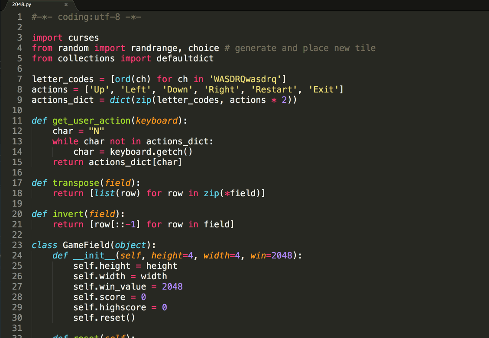
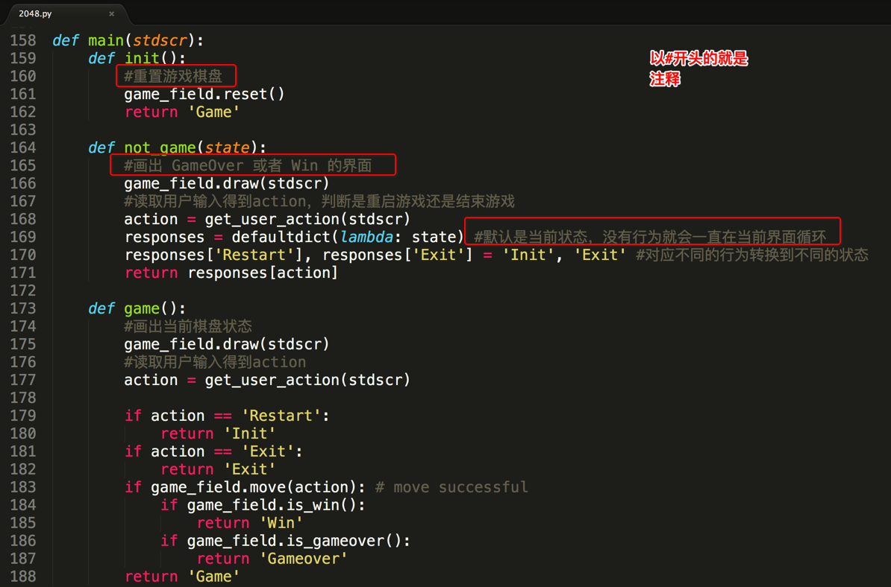

# 注释、变量以及类型

## 注释

  为什么要使用注释? 先看以下的代码:

  

  这段代码，没有一行的注释，我们在阅读代码时，不能直接明了的看明白这段代码的具体功能是什么或者具体的意思是什么，就像咱们买了一件电器，而没有说明书一样，那么请看下面带了注释的代码:

  

  这段代码，我们就可以直接很直接明了的知道这句代码是什么意思，具体要实现什么功能。

### 注释的作用:

  在程序中对某句或者某段代码添加注释，能够大大的增强代码的可读性，以及提高工作的效率。

### 注释的分类:

- 单行注释:

  以 ``# ``开头，``#``右边的所有东西当做说明，而不是真正要执行的程序，起辅助说明作用
  ```Python
  # 下面代码输出 Hello Python
  print("Hello Python")

  print("Hello Python")  # 这行代码输出 Hello Python
  ```

- 多行注释:

  python 中多行注释使用三个单引号``'''``或三个双引号``"""``。

  ```Python
  '''
  这是多行注释
  这是多行注释
  这是多行注释
  '''

  """
  这是多行注释
  这是多行注释
  这是多行注释
  """
  ```

## 变量

### 变量的定义:

在程序中，有时我们需要对2个数据进行求和，那么该怎样做呢？

大家类比一下现实生活中，比如去超市买东西，往往咱们需要一个菜篮子，用来进行存储物品，等到所有的物品都购买完成后，在收银台进行结账即可

如果在程序中，需要把2个数据，或者多个数据进行求和的话，那么就需要把这些数据先存储起来，然后把它们累加起来即可

在Python中，存储一个数据，需要一个叫做变量的东西，如下示例:
```Python
num1 = 100 #num1就是一个变量，就好一个小菜篮子

num2 = 87  #num2也是一个变量

result = num1 + num2 #把num1和num2这两个"菜篮子"中的数据进行累加，然后放到 result变量中
```

**说明:**
- 所谓变量，可以理解为菜篮子，如果需要存储多个数据，最简单的方式是有多个变量，当然了也可以使用一个

- **程序就是用来处理数据的，而变量就是用来存储数据的**

### 变量赋值:

Python 中的变量赋值不需要类型声明。

每个变量在内存中创建，都包括变量的标识，名称和数据这些信息。

每个变量在使用前都必须赋值，变量赋值以后该变量才会被创建。

等号（=）用来给变量赋值。

等号（=）运算符左边是一个变量名,等号（=）运算符右边是存储在变量中的值。例如：
```python
name = "zhangsan"
age = 18
source = 88.5
```

### 多个变量赋值:
Python允许同时为多个变量赋值。例如：
```Python
a = b = c = 1
```
以上实例，创建一个整型对象，值为1，三个变量被分配到相同的内存空间上。

也可以为多个对象指定多个变量。例如：
```Python
name, age, source = "zhangsan", 18, 88.5
```

### 变量的类型:
- 生活中"类型" 的例子:

  


- 在程序中:
 为了更充分的利用内存空间以及更有效率的管理内存，变量是有不同的类型的，如下所示:

 

### <font color="#dd0000">怎么去知道一个变量的类型？</font>

- 在python中，只要定义了一个变量，而且它有数据，那么它的类型就已经确定了，不需要咱们开发者主动的去说明它的类型，系统会自动辨别

- 可以使用type(变量的名字)，来查看变量的类型
