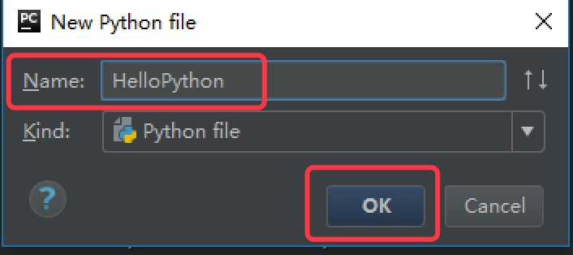

# 第一个Python程序

## 交互模式实现

  按住``win+r``输入``cmd``，在cmd中我们输入``python3``就会进入python3的交互模式

  

  在这 ``print("Hello Python")`` 中 ``print()``是一个函数(后续会讲解，也会一直用到)

  - 在Python3中 print 函数是需要有``()``的。
  - 在Python2中 print 函数不需要 ``()``的。

在Python2中使用print函数


## 脚本式实现

通过脚本参数调用解释器开始执行脚本，直到脚本执行完毕。当脚本执行完成后，解释器不再有效。

让我们写一个简单的 Python 脚本程序。所有 Python 文件将以 ``.py`` 为扩展名。将以下的源代码拷贝至 ``hello.py`` 文件中。

```Python
print("Hello Python")
```

我们打开命令行, 如果使用 python3解释器 就输入 ``python3 py文件`` 如果是 python2解释器，就输入 ``python2 py文件``


**[注意]**: 要注意运行文件的路径，我们直接输入cmd打开的命令行的路径是 ``C:\Users\Administrator>``,如果我们直接在这里去运行我们的py程序，会出现以下错误:


我们可以切换到我们py文件所在的路径进行运行，也可以在输入python3之后 直接将文件拖入到命令行中


## 使用Pycharm创建并运行

1. 打开 Pycharm，选择 ``Create New Project ``，创建一个新项目

  

2. 选择`` Pure Python ``表示创建一个纯Python程序项目,`` Location ``表示该项目保存的路径，``Interpreter ``表示使用的Python解释器版本，最后点击Create 创建项目。

  

3. 右击项目，选择``New ``，再选择`` Python File ``

  

4. 在弹出的对话框中输入的文件名HelloPython，点击``OK``，表示创建一个Python程序的文本文件，文本文件后缀名默认``.py``

  

5. 输入以下代码，并右击空白处，选择``Run``运行，表示打印一个字符串``"Hello World!"``。
  ```python
  print("Hello World!")
  ```

  

6. 运行成功后，Pycharm Console窗口将显示我们的输出结果。

  
