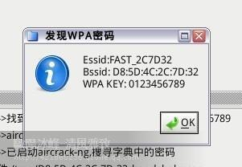
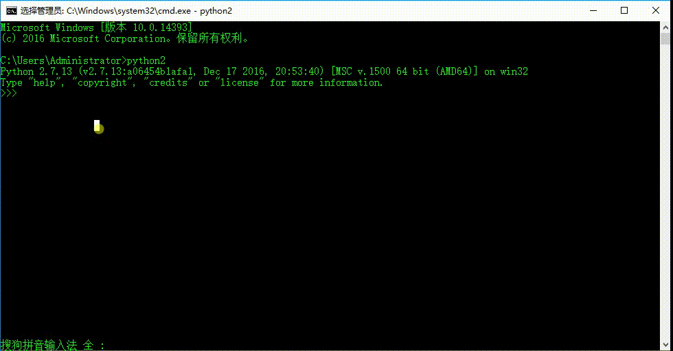
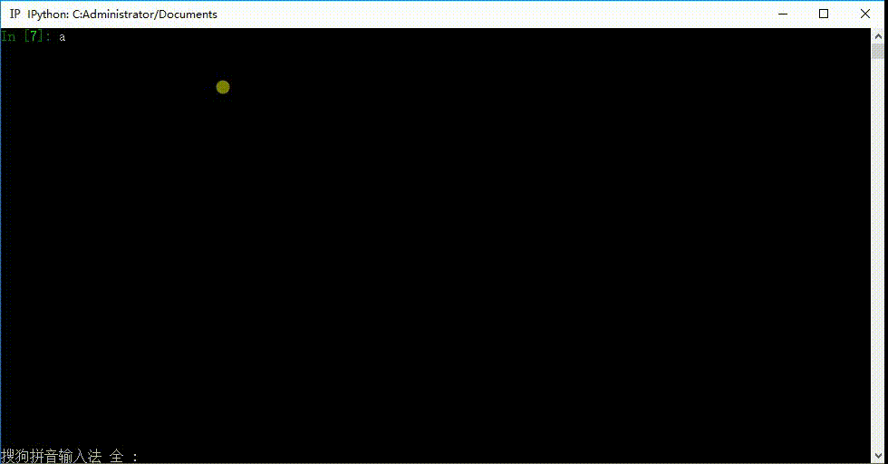

# 输出和输入

## 输出
 - 生活中常见的输出:

  

  

  

 - 软件中的输出:

  

- Python的变量输出:

 ```Python
 name = "zhangsan"
 print(name)

 # 输出结果是  zhangsan
 ```

- Python中的输出函数: ``print``

 - 在Python2中, 语法  `` print 输出的值``

 - 在Python3中, 语法  ``print("输出的值")``

 - 不同的就是在2中我们不需要(),在3中需要加上()

## 格式化输出

### 格式化操作的目的

  先看下面的代码:
  ```Python
  pirnt("我今年10岁")
  pirnt("我今年11岁")
  pirnt("我今年12岁")
    ...
  ```
  在上面的程序中,我们为了输出 ``今年XX岁`` 使用了很多次的print函数。我们是否可以进行简化一下呢，那就要使用``格式化输出``

### 什么是格式化

  有以下代码:

  ```Python
  In [5]: age = 10

  In [6]: print("今年我%d岁" % age)
  今年我10岁

  In [7]: age += 1

  In [8]: print("今年我%d岁" % age)
  今年我11岁

  In [9]: age += 1

  In [10]: print("今年我%d岁" % age)
  今年我12岁
  ```

  在程序中，看到了``%``这样的操作符，这就是Python中格式化输出。

  ```Python
  In [17]: name = "zhangsan"

  In [18]: age = 19

  In [19]: print("我的名字是%s, 今年%d岁" % (name, age))
  我的名字是zhangsan, 今年19岁
  ```

### 常见的格式符号

  |格式符号	|转换|
  | - |
  |%c	|字符|
  |%s	|通过str() 字符串转换来格式化
  |%i	|有符号十进制整数|
  |%d	|有符号十进制整数|
  |%u	|无符号十进制整数|
  |%o	|八进制整数|
  |%x	|十六进制整数（小写字母）|
  |%X	|十六进制整数（大写字母）|
  |%e	|科学计数法（小写'e'）|
  |%E	|科学计数法（大写“E”）|
  |%f	|浮点数|
  |%g	|％f和％e 的简写|
  |%G	|％f和％E的简写|

### 换行输出

  在输出的时候，如果有`` \n ``那么，此时 `` \n `` 后的内容会在另外一行显示
  ```Python
  In [21]: print("zhangsan\nlisi")
  zhangsan
  lisi
  ```

## 输入

### 如何理解输入？

  

  咱们在银行ATM机器前取钱时，肯定需要输入密码，对不？

  那么怎样才能让程序知道咱们刚刚输入的是什么呢？？

  大家应该知道了，如果要完成ATM机取钱这件事情，需要先``从键盘中输入一个数据``，然后用一个变量来保存，是不是很好理解啊

### Python2中的输入

#### raw_input()

  在Python2中，获取键盘输入的数据的方法是采用`` raw_input ``函数（至于什么是函数，咱们以后的章节中讲解），那么这个`` raw_input ``怎么用呢?

  ```Python
  password = raw_input("请输入密码:")
  print '您刚刚输入的密码是:', password
  ```
  程序运行结果:

  

  注意:

- raw_input()的小括号中放入的是，提示信息，用来在获取数据之前给用户的一个简单提示

- raw_input()在从键盘获取了数据以后，会存放到等号右边的变量中

- raw_input()会把用户输入的任何值都作为字符串来对待

#### input()

  获取用户的输入，获取到的输入的类型，输入的是什么类型的数据，获取到的就是什么类型的数据，

  比如输入的是数字的 110 ，接收的也是 int类型的 110

  


### Python3中的输入

<font color='red'>没有raw_input()函数，只有input()</font>

并且 python3中的input与python2中的raw_input()功能一样

#### input()

- 会将用户输入的任何类型都作为字符串来处理


