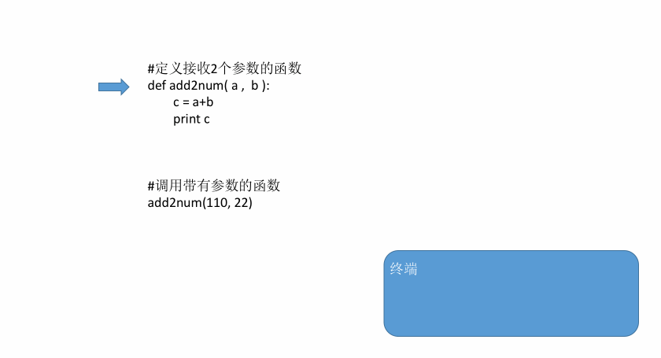

# 函数的参数一

思考一个问题:

现在需要定义一个函数，这个函数能够完成2个数的加法运算，并且把结果打印出来，该怎样设计？下面的代码可以吗？有什么缺陷吗？
```python
def add2num():
    a = 11
    b = 22
    c = a+b
    print c
```
为了让一个函数更通用，即想让它计算哪两个数的和，就让它计算哪两个数的和，<font color='red'>在定义函数的时候可以让函数接收数据，就解决了这个问题，这就是 函数的参数</font>

## 定义带有参数的函数

Demo:
```python
def add2num(a, b):
    c = a+b
    print c
```

## 调用带有参数的函数

以调用上面的add2num(a, b)函数为例:
```python
def add2num(a, b):
    c = a+b
    print c

add2num(11, 22) #调用带有参数的函数时，需要在小括号中，传递数据
```

调用带有参数函数的运行过程：



### 带有参数的函数使用的练习

要求：定义一个函数，完成前2个数完成加法运算，然后对第3个数，进行减法；然后调用这个函数

- 使用def定义函数，要注意有3个参数

- 调用的时候，这个函数定义时有几个参数，那么就需要传递几个参数

  Demo:

  ```python
  # 定义一个函数
  def getnums(a, b, c):

      res = a + b - c

      print("函数执行后的结果是:%d" % res)

  # 调用函数
  getnums(2, 3, 4)

  ```

### 调用函数时参数的顺序

```python
In [2]: def test(a, b):
   ...:     print(a, b)
   ...:

In [3]: test(1, 2)
1 2

In [4]: test(b=2, a= 1)
1 2

In [5]: test(b=1, 3)
  File "<ipython-input-5-990b1e053bc5>", line 1
    test(b=1, 3)
             ^
SyntaxError: positional argument follows keyword argument
```

<font color='red'><b>注意：我们在给函数传递参数的时候，一定要实现参数的一一对应</b></font>

## 形参和实参

- <font color='red'><b>定义时小括号中的参数，用来接收参数用的，称为 “形参”</b></font></b></font>


- <font color='red'><b>调用时小括号中的参数，用来传递给函数用的，称为 “实参”</b></font>
