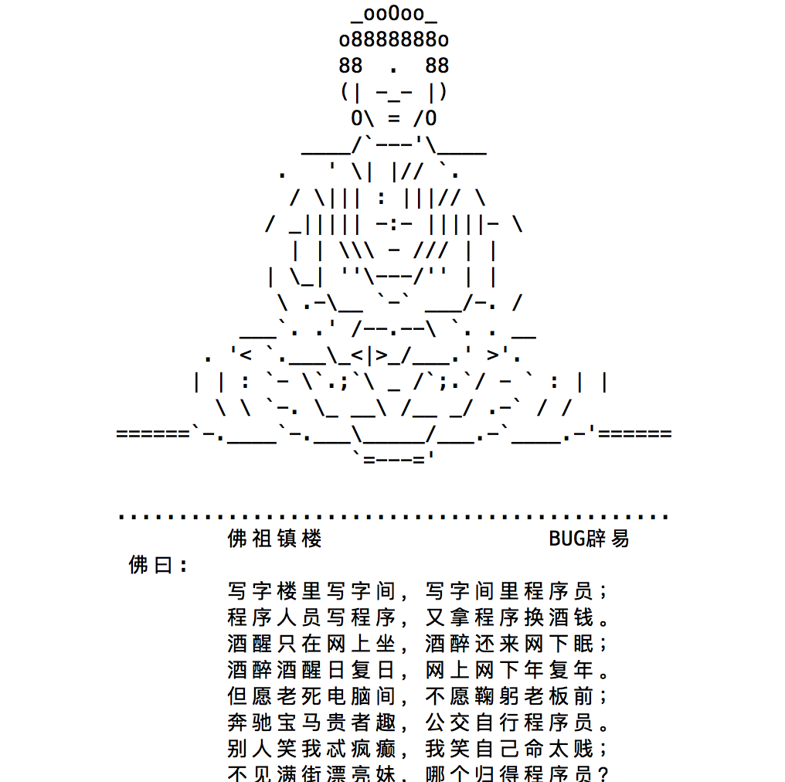

# 函数的基本使用

## 什么是函数？

请看以下代码:

  ```python
  print("                            _ooOoo_  ")
  print("                           o8888888o  ")
  print("                           88  .  88  ")
  print("                           (| -_- |)  ")
  print("                            O\\ = /O  ")
  print("                        ____/`---'\\____  ")
  print("                      .   ' \\| |// `.  ")
  print("                       / \\||| : |||// \\  ")
  print("                     / _||||| -:- |||||- \\  ")
  print("                       | | \\\\\\ - /// | |  ")
  print("                     | \\_| ''\\---/'' | |  ")
  print("                      \\ .-\\__ `-` ___/-. /  ")
  print("                   ___`. .' /--.--\\ `. . __  ")
  print("                ."" '< `.___\\_<|>_/___.' >'"".  ")
  print("               | | : `- \\`.;`\\ _ /`;.`/ - ` : | |  ")
  print("                 \\ \\ `-. \\_ __\\ /__ _/ .-` / /  ")
  print("         ======`-.____`-.___\\_____/___.-`____.-'======  ")
  print("                            `=---='  ")
  print("  ")
  print("         .............................................  ")
  print("                  佛祖镇楼                  BUG辟易  ")
  print("          佛曰:  ")
  print("                  写字楼里写字间，写字间里程序员；  ")
  print("                  程序人员写程序，又拿程序换酒钱。  ")
  print("                  酒醒只在网上坐，酒醉还来网下眠；  ")
  print("                  酒醉酒醒日复日，网上网下年复年。  ")
  print("                  但愿老死电脑间，不愿鞠躬老板前；  ")
  print("                  奔驰宝马贵者趣，公交自行程序员。  ")
  print("                  别人笑我忒疯癫，我笑自己命太贱；  ")
  print("                  不见满街漂亮妹，哪个归得程序员？")
  ```
运行效果:

  

想一想： 如果在一个程序中不同的地方需要输出``"佛祖镇楼"``，程序该如何设计？

前几天咱们写代码，可以这么解决：

  ```python
  if 条件1:
      输出‘佛祖镇楼’

  ...(省略)...

  if 条件2:
      输出‘佛祖镇楼’

  ...(省略)...
  ```
如果需要输出多次，是否意味着要编写这块代码多次呢？那就是说我们需要重复的去写上面的那么一大段代码，这样的话，会一直去做一些重复的工作，大大的降低了我们代码的效率。那么我们是不是可以将某些重复的代码组织成为一个具有独立功能的模块呢？

### 小总结:

```
如果在开发程序时，需要某块代码多次，但是为了提高编写的效率以及代码的重用，
所以把具有独立功能的代码块组织为一个小模块，这就是函数
```

## 函数的定义和调用

### 函数的定义

定义函数的格式如下:
```python
def 函数名():
  函数中执行的代码
```

Demo:
```python
# 定义一个函数，能够完成打印信息的功能
def printInfo():
    print('------------------------------------')
    print('         人生苦短，我用Python')
    print('------------------------------------')
```

### 调用函数
定义了函数之后，就相当于有了一个具有某些功能的代码，想要让这些代码能够执行，需要调用它

调用函数很简单的，通过 <font color='red'><b>函数名() <b></font>即可完成调用

Demo:

```python

# 定义一个函数，能够完成打印信息的功能
def printInfo():
    print('------------------------------------')
    print('         人生苦短，我用Python')
    print('------------------------------------')

# 定义完函数后，函数是不会自动执行的，需要调用它才可以
printInfo()
```

### 注意

- <font color='red'>函数在定义的时候，只会去定义函数，不回去执行函数中的代码</font>


- <font color='red'>只有在调用函数的时候，才会执行函数中的代码。</font>


- 每次调用函数时，函数都会从头开始执行，当这个函数中的代码执行完毕后，意味着调用结束了

- 当然了如果函数中执行到了return也会结束函数

## 函数的说明文档

在前面我们学到了注释，注释的作用就是起到解释说明的作用，那么在函数中，我们编写函数的时候，也可以编写一个函数的说明文档，那么就会提高代码的可读性。那么我们怎么在定义函数的说明文档呢？请看下面的例子

Demo:

```python
def add2num(a, b):
    """完成对两个数进行求和"""
    c = a + b
    return c
```

定义函数的说明文档，我们需要在定义完函数之后，紧接着使用 三个单引号或者双引号 来写函数的说明文档。

那么我们怎么去查看函数的说明文档呢？ 答案是使用  <font color='red'>help(函数名)</font>

```python
help(add2num)
```

运行效果:
```
Help on function add2num in module __main__:

add2num(a, b)
    完成对两个数进行求和
```

## 函数的嵌套调用

在前面我们学到的if判断while循环是可以嵌套的，那么我们函数这边也是可以进行嵌套调用的。

那么什么是函数的嵌套呢？请看下面的例子:

Demo:
```python
def testB():
    print('---- testB start----')
    print('这里是testB函数执行的代码...(省略)...')
    print('---- testB end----')

def testA():
    print('---- testA start----')
    testB()
    print('---- testA end----')

testA()
```

执行结果:

```python
---- testA start----
---- testB start----
这里是testB函数执行的代码...(省略)...
---- testB end----
---- testA end----
```

### 小总结:

- 一个函数里面又调用了另外一个函数，这就是所谓的函数嵌套调用

  

- 如果函数A中，调用了另外一个函数B，那么先把函数B中的任务都执行完毕之后才会回到上次 函数A执行的位置
