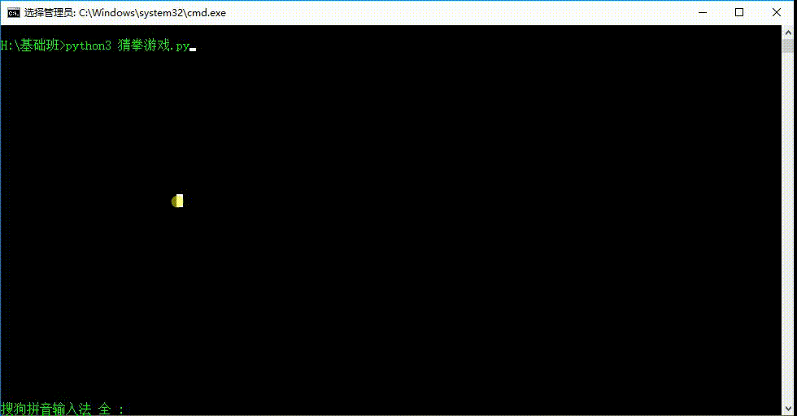

# if嵌套和猜拳游戏的练习

## if嵌套

通过学习if的基本用法，已经知道了

- 当需要满足条件去做事情的这种情况需要使用if
- 当满足条件时做事情A，不满足条件做事情B的这种情况使用if-else

想一想:

坐火车或者地铁的实际情况是：先进行安检如果安检通过才会判断是否有车票，或者是先检查是否有车票之后才会进行安检，即实际的情况某个判断是再另外一个判断成立的基础上进行的，这样的情况该怎样解决呢？

答:  if嵌套

### if嵌套的格式

  ```
  if 条件1:

    满足条件1 做的事情1
    满足条件1 做的事情2
    ...(省略)...

    if 条件2:
        满足条件2 做的事情1
        满足条件2 做的事情2
        ...(省略)...
  ```

- 说明:

  - 外层的if判断，也可以是if-else

  - 内层的if判断，也可以是if-else

  - 根据实际开发的情况，进行选择

### if嵌套的应用:

Demo:

  ```Python
  # 用1代表有车票，0代表没有车票
  chePiao = 1
  # 刀子的长度，单位为cm
  daoLength = 9

  if chePiao == 1:
      print("有车票可以进站，即将进行安检")

      if daoLength < 10:
          print("通过安检")
          print("可以进站啦")
      else:
          print("没有通过安检")
          print("刀子的长度超过规定，等待警察处理....")
  else:
      print("没有车票，不能进站，请先购票")
  ```

  - 结果1：chePiao = 1;daoLenght = 9

  ```
  有车票可以进站，即将进行安检
  通过安检
  可以进站啦

  分析: 有车票，那么我们就可以进行安检，刀子的长度是9，是小于规定的10cm的，
  所以两个条件都是成立的，我们就可以进站了。
  ```

  - 结果2：chePiao = 1;daoLenght = 20

  ```
  有车票可以进站，即将进行安检
  没有通过安检
  刀子的长度超过规定，等待警察处理....

  分析: 有车票，那么我们可以进行安检，刀子的长度是20，是超过了规定的10cm的，
  所以，我们没有通过安检，需要等待警察的处理。
  ```

  - 结果3：chePiao = 0;daoLenght = 9

  ```
  没有车票，不能进站，请先购票

  分析: 没有车票，我们不能进站进行安检，所以直接提示没有车票，请先购票
  ```

  - 结果4：chePiao = 0;daoLenght = 20

  ```
  没有车票，不能进站，请先购票

  分析: 没有车票，我们不能进站进行安检，所以直接提示没有车票，请先购票
  ```

### if嵌套的练习:

用户登录的验证
 - 从键盘获取用户输入的用户名

 - 判断用户名是否存在，假定是固定的"zhangsan",如果存在就提示用户输入密码，不存在就提示"用户名不存在，请先注册"

 - 从键盘获取用户输入的密码。如果密码是"abc123",那么就提示用户:"欢迎您:zhangsan"

  ```Python
  username = input("请输入用户名")

  if username == "zhangsan":

      password = input("请输入密码：")

      if password == "abc123":
          print("欢迎您：%s" %username)
      else:
          print("密码不正确，请重新输入")
  else:
      print("用户名不存在，请先注册")
  ```

## 猜拳游戏

 - 用户输入``剪刀(用0代替)  石头(用1代替)  布(用2代替)``

 - 机器随机的生成``剪刀(用0代替)  石头(用1代替)  布(用2代替)``

 - 用户赢的情况:

  - 用户剪刀(0),机器布(2)

  - 用户石头(1),机器剪刀(0)

  - 用户布(2),机器石头(1)

- 平局情况:``  用户出拳 == 机器出拳 ``

- 剩余情况就是机器赢了。

### Python中的随机数(random)模块

 - <font color='red'>要使用random模块，首先要导入random模块</font>


 - random() 方法返回随机生成的一个实数，它在[0,1)-->``(前闭后开区间就是说包括0,但是不包含1)``范围内。

 Demo：

 ```Python
 In [4]: import random

 In [5]: random.random()
 Out[5]: 0.5651751563620334

 In [6]: random.random()
 Out[6]: 0.9709276545285946

 In [7]: random.random()
 Out[7]: 0.9624403765073262
 ```

 - random.randint(start,stop) 生成start到stop之间的整数``(闭区间,包含start和stop)``

 Demo:

 ```Python
 In [22]: import random

 In [23]: random.randint(1,10)
 Out[23]: 9

 In [24]: random.randint(1,10)
 Out[24]: 10

 In [25]: random.randint(1,10)
 Out[25]: 3

 In [26]: random.randint(1,10)
 Out[26]: 4
 ```

### 猜拳游戏代码:

  ```Python
  # 要使用随机数random模块，首先我们要导入
  import random

  # 获取用户的输入
  player = input("请输入：剪刀(0)  石头(1)  布(2):")

  # 强制类型转换，将获取到的字符串类型转换成int类型
  player = int(player)

  print("用户出拳:%d" %player)

  # 随机的生成机器的出拳
  computer = random.randint(0, 2)
  print("电脑出拳:%d" %computer)

  # 判断用户是赢还是输
  """
  用户赢的情况:
    - 用户剪刀(0) 并且(and) 机器布(2)   

    - 用户石头(1) 并且(and) 机器剪刀(0)

    - 用户布(2) 并且(and) 机器石头(1)

    三种关系是或者的关系，也就是or
  """

  if (player == 0) and (computer == 2) or (player == 1) and (computer == 0) or (player == 2) and (computer == 1):
      print("用户获胜，哈哈，你太厉害了")
  # 平局的情况
  elif player == computer:
      print("平局，要不再来一局？")
  # 用户输了
  else:
      print("机器赢得了胜利，不要走，洗洗手接着来，决战到天亮")
  ```

### 运行效果:

  
