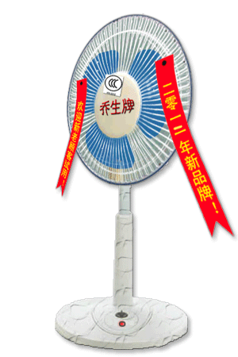

# while循环及其应用

## 循环的介绍

### 生活中的循环场景:

  跑道

  

  电风扇:

  

  加特林

  

### 软件开发中循环的使用场景

跟媳妇承认错误，说一万遍"媳妇儿，我错了"
  ```Python
  print("媳妇儿，我错了")
  print("媳妇儿，我错了")
  print("媳妇儿，我错了")
  ...(还有99997遍)...
  ```

使用循环语句一句话搞定

  ```Python
  i = 0
  while i < 10000:
      print("媳妇儿，我错了")
      i += 1
  ```

### 小总结

- 一般情况下，需要多次重复执行的代码，都可以用循环的方式来完成

- 循环不是必须要使用的，但是为了提高代码的重复使用率，所以有经验的开发者都会采用循环

## while循环

### while循环的格式:

  ```
  while 条件:
      条件满足时，做的事情1
      条件满足时，做的事情2
      条件满足时，做的事情3
      ...(省略)...
  ```
Demo:

  ```Python
  i = 0
  while i < 5:
      print("当前是第%d次执行循环" % (i + 1))
      print("i=%d" % i)
      i += 1
  ```
结果:

  ```
  当前是第1次执行循环
  i=0
  当前是第2次执行循环
  i=1
  当前是第3次执行循环
  i=2
  当前是第4次执行循环
  i=3
  当前是第5次执行循环
  i=4
  ```

## while循环的应用

### 1. 计算1~100的累加和(包含1和100)

参考代码如下:

  ```Python
  i = 1
  sum = 0

  while i <=100:
      sum += i
      i += 1

  print("1~100的累加和是%d" %sum)
  ```

### 2. 计算1~100之间偶数的累积和（包含1和100）

参考代码如下:

  ```Python
  i = 1
  sum = 0

  while i <=100:
      if i % 2 == 0:
          sum += i
      i += 1

  print("1~100的累加和是%d" %sum)
  ```
