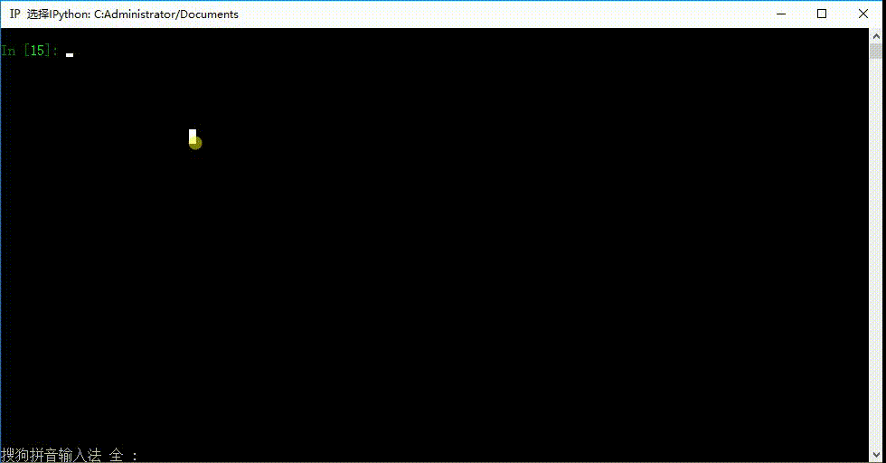

# while循环嵌套以及for循环

## while循环嵌套
前面学习过if的嵌套了，想一想if嵌套是什么样子的？

类似if的嵌套，while嵌套就是：while里面还有while

### while嵌套的格式

```
while 条件1:

    条件1满足时，做的事情1
    条件1满足时，做的事情2
    条件1满足时，做的事情3
    ...(省略)...

    while 条件2:
        条件2满足时，做的事情1
        条件2满足时，做的事情2
        条件2满足时，做的事情3
        ...(省略)...
```

### while嵌套应用一；

打印三角形:
```
*
* *
* * *
* * * *
* * * * *
```

代码如下:

```Python
i = 1

while i <= 5:
	j = 1

	while j <= i:
		print("* ", end="")
		j += 1

	print("\n")
	i += 1
```


### while嵌套应用二：九九乘法表


代码如下:
```Python
i = 1
while i<=9:
    j=1
    while j<=i:
        print("%d*%d=%-2d " % (j, i, i*j), end = '')
        j+=1
    print('\n')
    i+=1
```


## for 循环
像while循环一样，for可以完成循环的功能。

在Python中 for循环可以遍历任何序列的项目，如一个列表或者一个字符串等。

### for循环的格式
```
for 临时变量 in 列表或者字符串等:
    循环满足条件时执行的代码
```

Demo1:
```Python
name = 'Python'

for x in name:
    print(x)
```

打印结果:

```
P
y
t
h
o
n
```


Demo2:

```Python
name = "hello"

for x in name:
    print(x)

    if x == "l":
        break  # break 退出for循环
else:
    print("==for循环过程中，如果没有break则执行==")
```

执行结果:
```
h
e
l
```

Demo3:
```Python
name = "hello"

for x in name:
    print(x)

    # if x == "l":
    #     break  # break 退出for循环
else:
    print("==for循环过程中，如果没有break则执行==")
```

执行结果:

```
h
e
l
l
o
==for循环过程中，如果没有break则执行==
```

总结:

- for循环的完整格式: ``for...else...``,也就是说，在for循环中，如果没有满足条件的数据，那么就会执行else中的代码。

- for我们会经常用于遍历当中。
