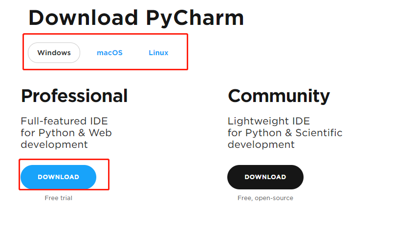
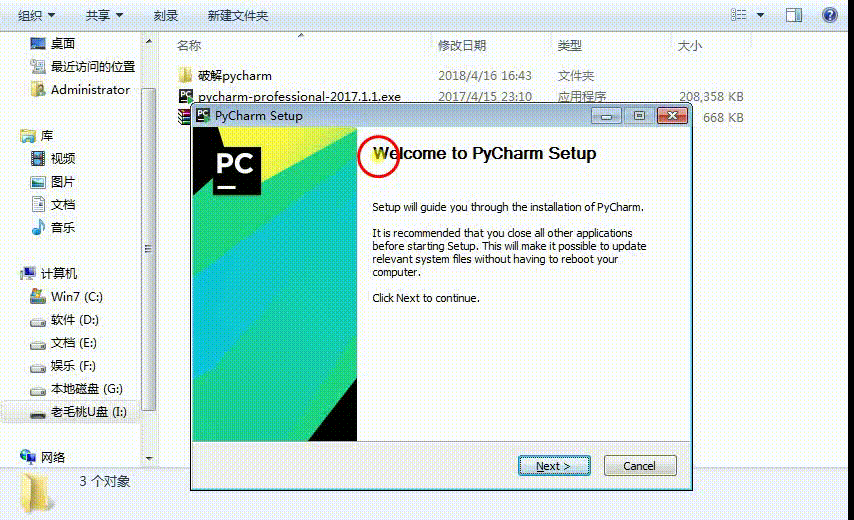
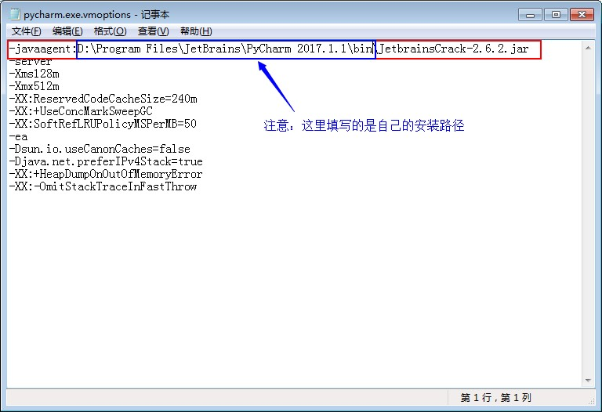
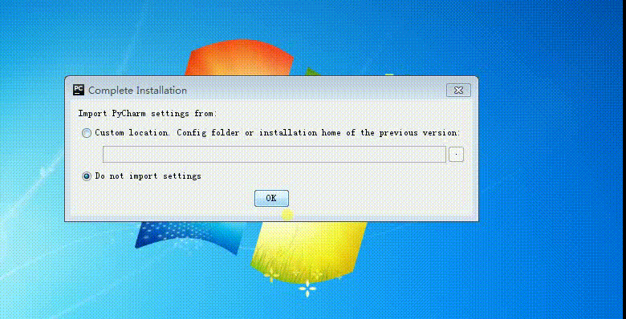

# pycharm安装与破解

## 1. 下载pycharm安装包

  下载地址:
  ```
  http://www.jetbrains.com/pycharm/download/#section=windows
  ```

  

## 2. 安装

  找到Pycharm的下载路径直接双击安装就可以。

  

  **[注意]**: 在设置好安装路径后，点击next需要稍微等待一下。安装完成之后先不要启动，我们需要对Pycharm破解一下。

## 3. Pycharm破解

  - 首先我们要找到我们的Pycharm的安装路径，我的是安装在  ``D:\Program Files\JetBrains\PyCharm 2017.1.1``

  - 复制破解文件 ``JetbrainsCrack-2.6.2.jar`` 到 ``D:\Program Files\JetBrains\PyCharm 2017.1.1\bin``文件夹下。

  - 这时候，我们需要修改Pycharm的配置文件了，打开文件 ``pycharm.exe.vmoptions`` 文件(记事本打开就可以)，我们要将这句话(``-javaagent:D:\PyCharm 2017.1.1\bin\JetbrainsCrack-2.6.2.jar``)复制到文件的首行,如下图:

  

  - 下一步操作，是打开``pycharm64.exe.vmoptions``,进行和上面一样的操作就可以

  - 接下来我们打开Pycharm。按照下面的操作就可以

  
