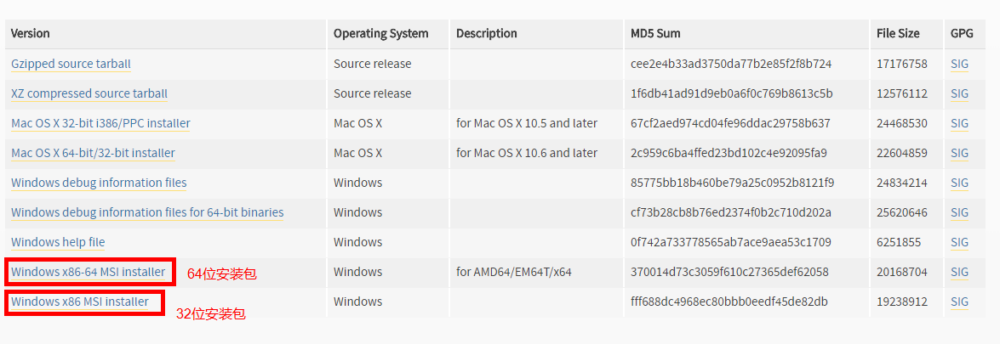
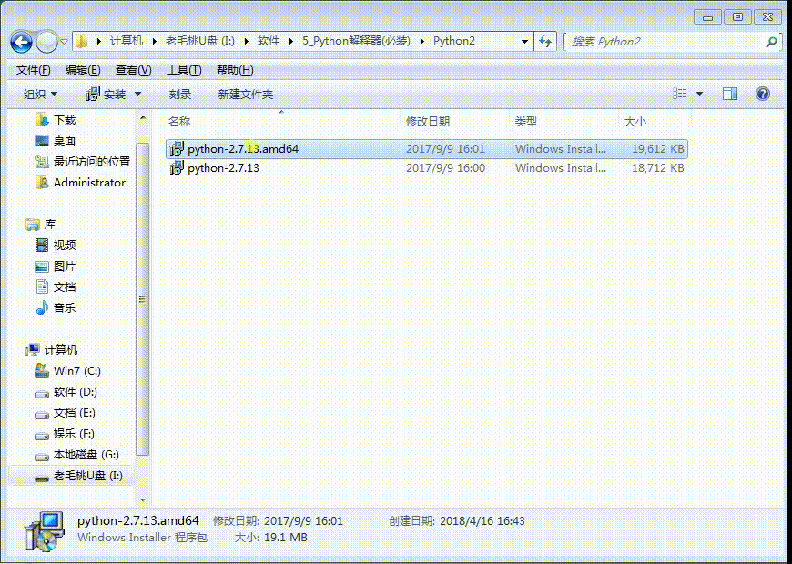
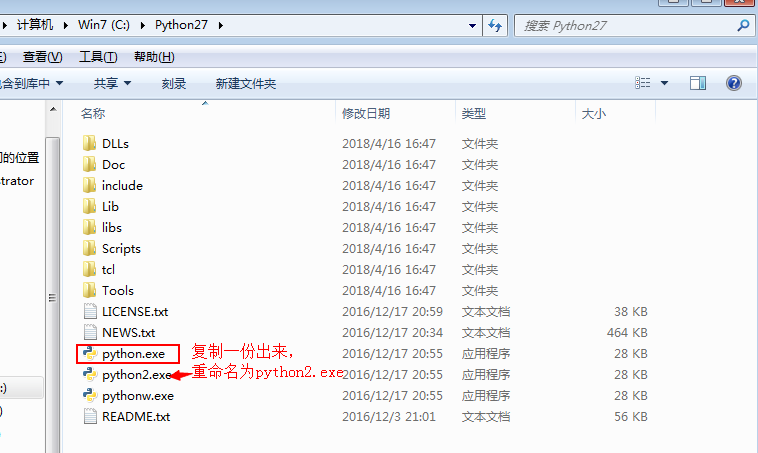
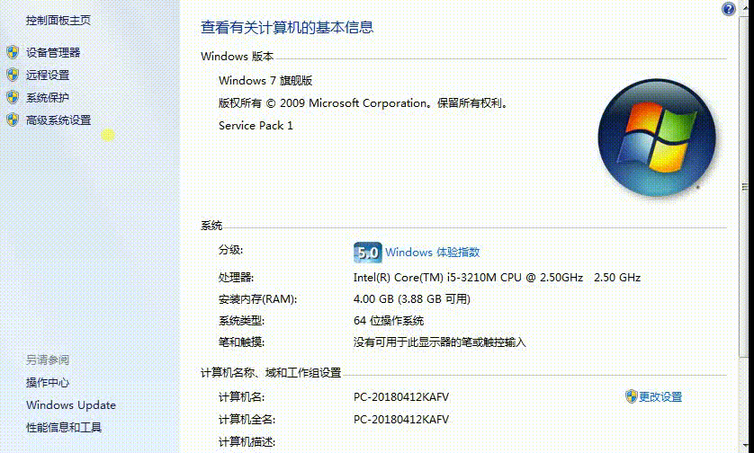
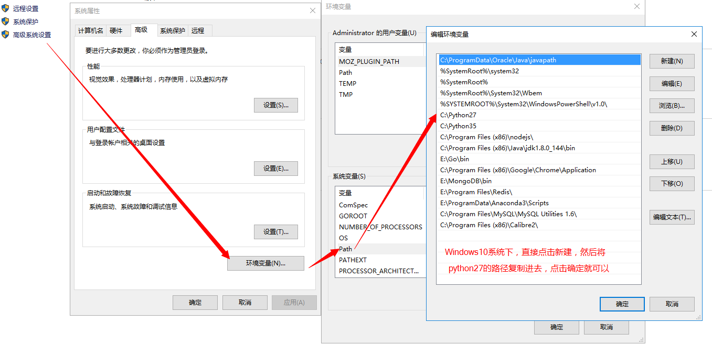

# Windows下安装Python2.7

## 1. 下载安装包

  下载地址:
  ```
  https://www.python.org/downloads/release/python-2714/
  ```

  如图所示，下载对应的版本

  

## 2. 安装

  找到对应的下载目录，双击安装包进行安装，流程如下图：

  

## 3. 配置

  默认的Python2安装在C盘的Python27目录下，我们要打开Python27目录进行操作:

  - 进入到Python27的安装目录
  - 将``python.exe``复制复制一份
  - 将复制的``python.exe``重命名为``python2.exe``，如下图所示：



## 4. 配置环境变量

  还是在Python27的安装路径下，我们需要将Python27的路径复制一下：

  

  然后右键点击计算机，选择属性，接下来操作如图所示：

  Windows 7 系统：

  

  Windows 10 系统:

  

  **[注意]**: 在将python27的路径复制过去的时候需要加分号(注意是英文的分号)

  添加完环境变量之后，就可以点击确定了(在高级系统变量打开的小窗口都点击确定)

## 5. 检测环境变量是否配置成功

  - 按 ``win+r`` 会弹出一个输入窗口，我们在输入框中输入 ``cmd`` 然后回车
  - 回车之后会弹出一个命令窗口，这时我们在命令窗口中输入 ``python2`` 然后回车
  - 如果出现以下显示则说明环境变量配置成功:
```
C:\Users\Administrator>python2
Python 2.7.13 (v2.7.13:a06454b1afa1, Dec 17 2016, 20:53:40) [MSC v.1500 64 bit (AMD64)] on win32
Type "help", "copyright", "credits" or "license" for more information.
>>>
```

  

 **至此，Windows下安装Python2就已经安装成功**
