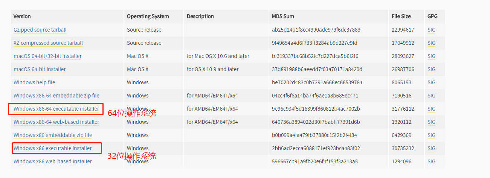
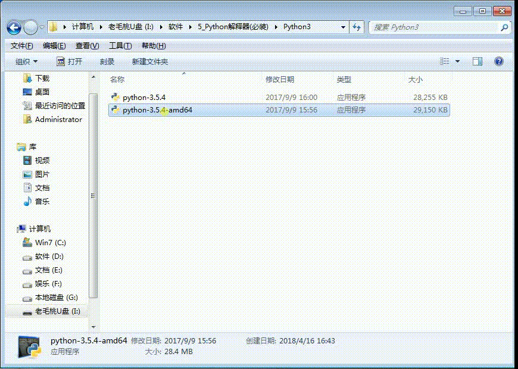
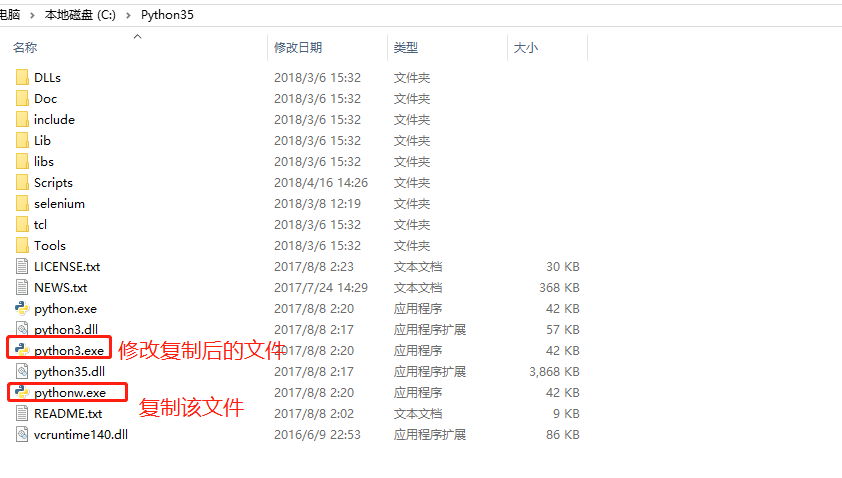
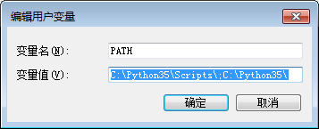
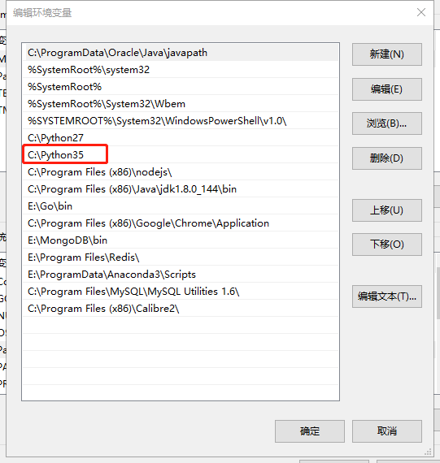

# Windows下安装Python2.7

## 1. 下载安装包

  下载地址:
  ```
  https://www.python.org/downloads/release/python-365/
  ```

  如图所示，下载对应的版本

  

## 2. 安装

  找到对应的下载目录，双击安装包进行安装，流程如下图：

  

## 3. 配置

  在安装的时候Python3安装在C盘的Python35目录下，我们要打开Python35目录进行操作:

  - 进入到Python35的安装目录
  - 将``python.exe``复制复制一份
  - 将复制的``python.exe``重命名为``python3.exe``，如下图所示：



## 4. 配置环境变量

  在Python3.5 安装的时候我们默认的勾选了一个选项  ``Add to PATH `` 这时Python3.5 已经默认的配置到环境变量中了

  Windows7 系统:

  

  Windows 10 系统:

  

## 5. 检测环境变量是否配置成功

  - 按 ``win+r`` 会弹出一个输入窗口，我们在输入框中输入 ``cmd`` 然后回车
  - 回车之后会弹出一个命令窗口，这时我们在命令窗口中输入 ``python3`` 然后回车
  - 如果出现以下显示则说明环境变量配置成功:
```
C:\Users\Administrator>python3
Python 3.5.4 (v3.5.4:3f56838, Aug  8 2017, 02:17:05) [MSC v.1900 64 bit (AMD64)] on win32
Type "help", "copyright", "credits" or "license" for more information.
>>>
```


 **至此，Windows下安装Python2就已经安装成功**
