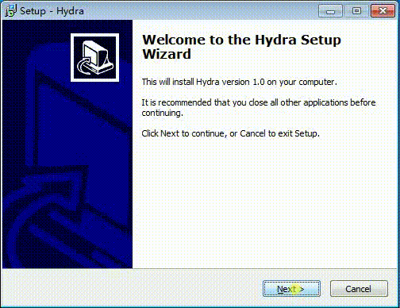
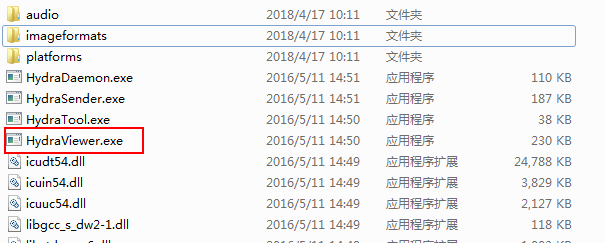
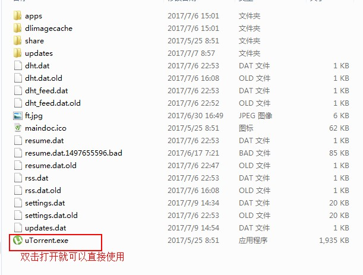

## 飞秋的安装

  飞秋是局域网聊天工具，可以说是局域网版本的QQ

  飞秋的安装和简单，只要双击打开就行，会弹出一个框，如果需要更改路径就更改，或者直接选择默认就可以。

  **[注意]**: 关闭防火墙

## 公屏软件Hydra安装

  也和正常安装软件一样，双击打开软件，下一步下一步的安装就可以

  

  安装完成之后桌面是没有快捷方式的，我们需要找到安装的路径，将``HydraViewer.exe``创建一个桌面的快捷方式就可以。

  

  **[注意]**: 关闭防火墙

## 种子软件(uTorrent)

  直接``uTorrent``的压缩包解压之后就可以使用。

  

##  其他软件(选择性安装)
- submitText3  (阅读代码)

- Notepad++  (阅读代码)

- FastStone Capture   (截图软件)

- screen-recorder    (截图软件)

- 有道翻译

- xmind    (梳理知识点、总结)

- 有道云笔记   (记录笔记)
