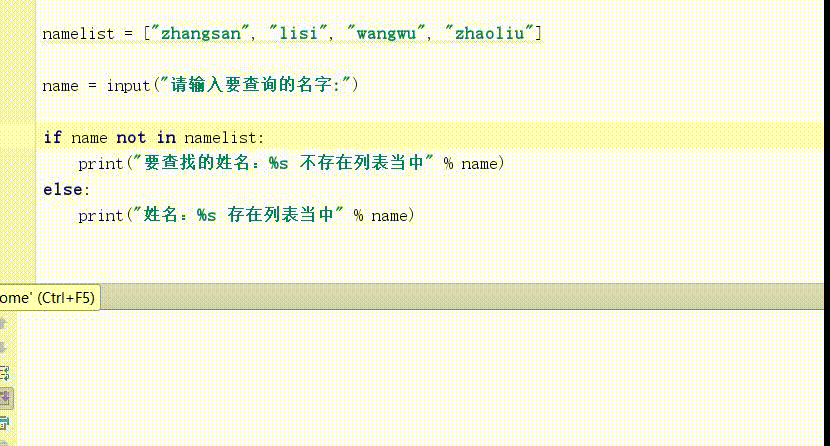

# not in

<table>
    <tr>
        <td><b>语法</b></td>
        <td><b>用法</b></td>
        <td><b>描述</b></td>
   </tr>
   <tr>
      <td>not in</td>
      <td>if x not in list</td>
      <td>not in（不存在），如果不存在那么结果为true，否则false</td>
   </tr>
</table>

实例:

```python
namelist = ["zhangsan", "lisi", "wangwu", "zhaoliu"]

name = input("请输入要查询的名字:")

if name not in namelist:
    print("要查找的姓名：%s 不存在列表当中" % name)
else:
    print("姓名：%s 存在列表当中" % name)
```
运行效果:

