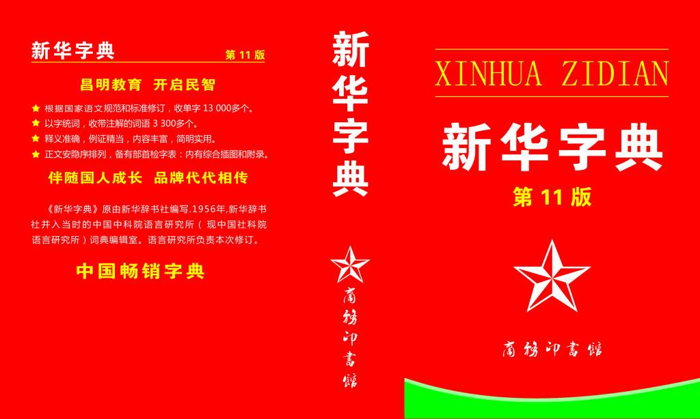

# 字典

## 字典介绍

想一想：

如果有列表
```python
nameList = ['xiaoZhang', 'xiaoWang', 'xiaoLi']
```
需要对"xiaoWang"这个名字写错了，通过代码修改：

```python
nameList[1] = 'xiaoxiaoWang'
```
如果列表的顺序发生了变化，如下
```python
nameList = ['xiaoWang', 'xiaoZhang',  'xiaoLi']
```
此时就需要修改下标，才能完成名字的修改
```python
nameList[0] = 'xiaoxiaoWang'
```
有没有方法，既能存储多个数据，还能在访问元素的很方便就能够定位到需要的那个元素呢？

答：

<font color='red'><b>字典</b></font></br>

另一个场景：

学生信息列表，每个学生信息包括学号、姓名、年龄等，如何从中找到某个学生的信息？

**循环遍历？ No！**

## 生活中的字典



## 软件开发中的字典:

变量info为字典类型：
```python
info = {'name':'班长', 'id':100, 'sex':'f', 'address':'地球亚洲中国北京'}
```
说明：

- 字典和列表一样，也能够存储多个数据
- 列表中找某个元素时，是根据下标进行的
- 字典中找某个元素时，是根据'名字'（就是冒号:前面的那个值，例如上面代码中的'name'、'id'、'sex'）
- 字典的每个元素由2部分组成，键:值。例如 'name':'班长' ,'name'为键，'班长'为值

## python 中的字典
- 定义： 使用 <font color='red'><b>{ }</b></font>，定义字典，字典的元素是 <font color='red'><b>key: value </b></font>形式，即: <font color='red'><b>键值对</b></font>的形式

- 键  和  值 之间使用 `` ：``  隔开

- **键 必须是唯一的，同名的key，后者的值 会覆盖前者**

- **值可以取任何数据类型，但 键 只能使用 字符串、数字或 元组**
