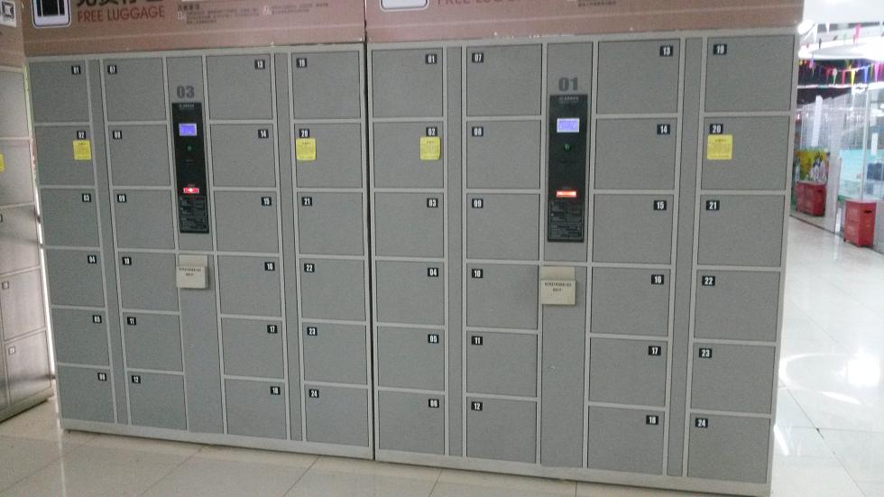
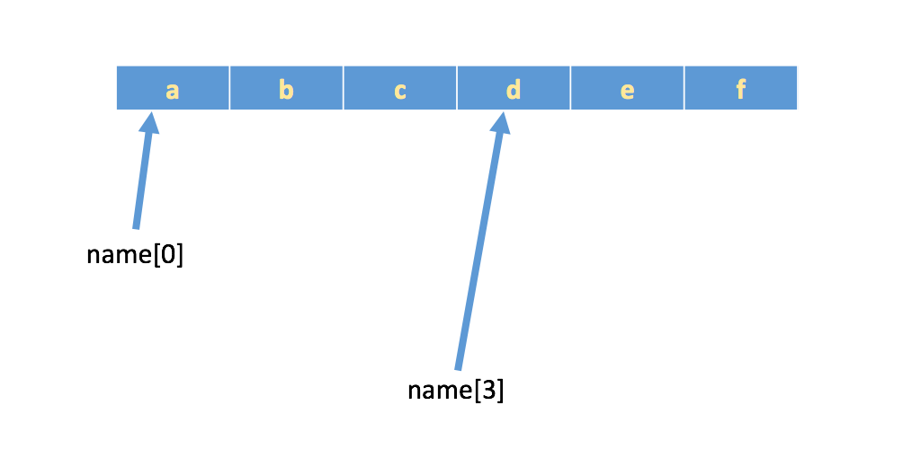

# 字符串

## 字符串介绍

### Python中字符串的格式

如下定义的变量a，存储的是数字类型的值
```
a = 100
```
如下定义的变量b，存储的是字符串类型的值

```
b = "hello itcast.cn"
或者
b = 'hello itcast.cn'
```
小总结：

- <font color='red'>双引号或者单引号中的数据，就是字符串</font>

### 字符串的输出

Demo:

  ```Python
  name = 'itheima'
  position = '讲师'
  address = '北京市昌平区建材城西路金燕龙办公楼1层'

  print('--------------------------------------------------')
  print("姓名：%s" % name)
  print("职位：%s" % position)
  print("公司地址：%s" % address)
  print('--------------------------------------------------')
  ```
结果:

  ```
  --------------------------------------------------
  姓名： itheima
  职位： 讲师
  公司地址： 北京市昌平区建材城西路金燕龙办公楼1层
  --------------------------------------------------
  ```
### 字符串的输入

之前在学习input的时候，通过它能够完成从键盘获取数据，然后保存到指定的变量中；

注意：input获取的数据，都以字符串的方式进行保存，即使输入的是数字，那么也是以字符串方式保存

Demo:

  ```Python
  userName = input('请输入用户名:')
  print("用户名为：%s" % userName)

  password = input('请输入密码:')
  print("密码为：%s" % password)
  ```
结果:(根据输入的不同结果也不同)

  ```
  请输入用户名:itheima
  用户名为： itheima
  请输入密码:haohaoxuexitiantianxiangshang
  密码为： haohaoxuexitiantianxiangshang
  ```

## 下标和切片

### 下标索引

所谓``“下标”``，就是编号，就好比超市中的存储柜的编号，通过这个编号就能找到相应的存储空间

- 生活中的下标:

  超市储物柜:

    

  高铁二等座

    

  高铁一等座

    

- 字符串中"下标"的使用

    列表与元组支持下标索引好理解，字符串实际上就是字符的数组，所以也支持下标索引。

    如果有字符串:name = 'abcdef'，在内存中的实际存储如下:

    

    如果想取出部分字符，那么可以通过下标的方法，（<font color='red'>注意python中下标从 0 开始</font>）

    ```Python
    name = 'abcdef'

    print(name[0])
    print(name[1])
    print(name[2])
    ```

    运行结果
    ```
    a
    b
    c
    ```

## 切片

切片是指对操作的对象截取其中一部分的操作。字符串、列表、元组都支持切片操作。

### 切片的语法：<font color='red'>[起始:结束:步长]</font>

**注意：选取的区间从"起始"位开始，到"结束"位的前一位结束（不包含结束位本身)，步长表示选取间隔。**

我们以字符串为例讲解。

如果取出一部分，则可以在中括号[]中，使用:

Demo1:

```Python
name = "abcdef"

print(name[0:3]) # 取出下标0-2的字符
```

运行结果:


Demo2:

```Python
name = 'abcdef'

print(name[0:5])  # 取 下标为0~4 的字符
```

运行结果:


Demo3:

```Python
name = "abcdef"

print(name[3:5]) # 取出下标3、4的字符
```


Demo4:

```Python
name = "abcdef"

print(name[2:0]) # 取出下标为2开始到最后的字符
```

运行结果:


Demo5:

```Python
name = 'abcdef'

print(name[1:-1]) # 取 下标为1开始 到最后第2个之间的字符
```

运行结果：


